# ***INSTALACION WORDPRESS USANDO DOCKER***
## Primero ejecutaremos este comando para que, en caso de tener paquetes instalados de docker, eliminarlos y que no ocurran problemas más adelante.
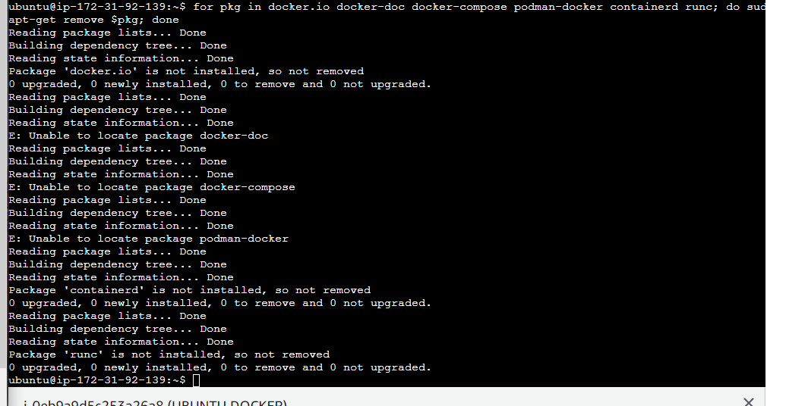
## Ejecutamos todos los comandos con los que añadimos la clave autorizada y luego añadimos unas líneas de comando (no tengo las capturas porque fue cuando daba error por no poner el /ubuntu y perdi las capturas de lo demás).
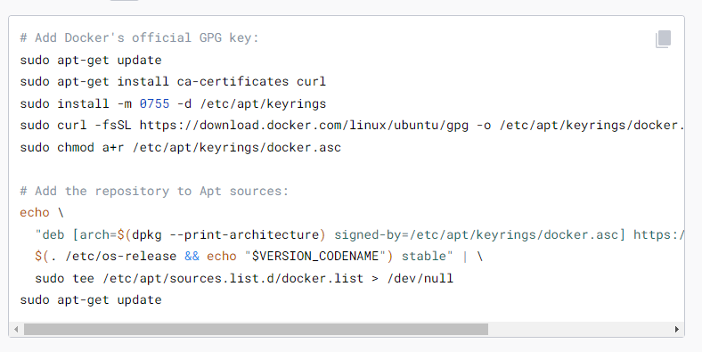
## Instalamos los paquetes de Docker.
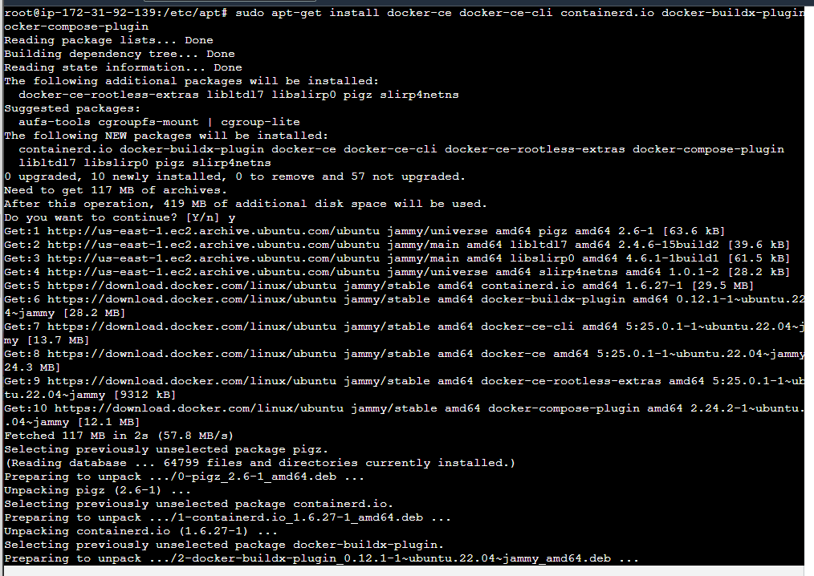
## Verificamos la instalación ejecutando la imagen hello-world.
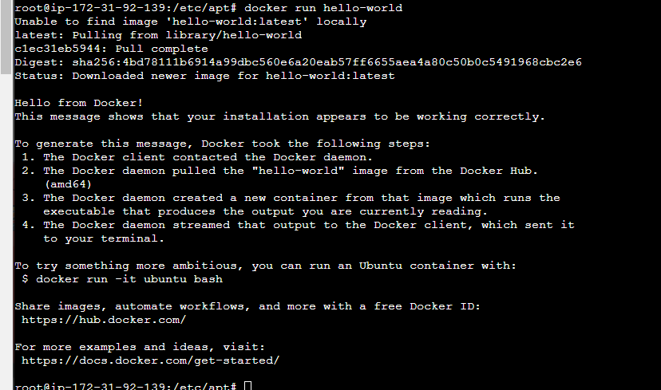
## Instalamos *compose* y comprobamos la versión.
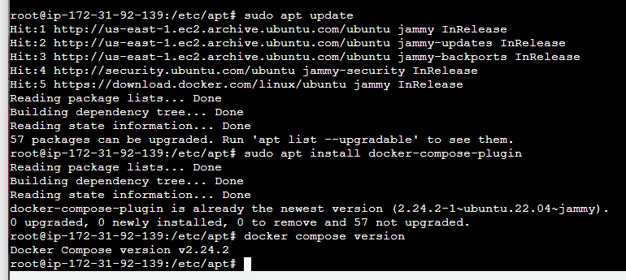
## Creamos el *.env* con las variables para el fichero del paso siguiente.
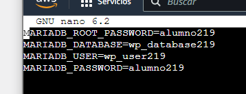
## Configuramos el *.yml* para que permita utilizar tanto **MariaDB**, **php** como **WordPress**.
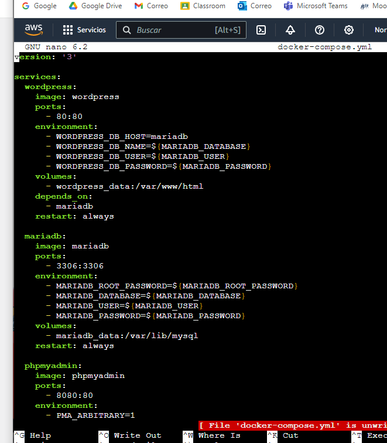
## Verificamos que tanto el *.env* como el *.yml* estan en el mismo directorio.
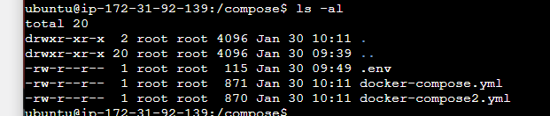
## Vemos que la imagen creada funciona correctamente.
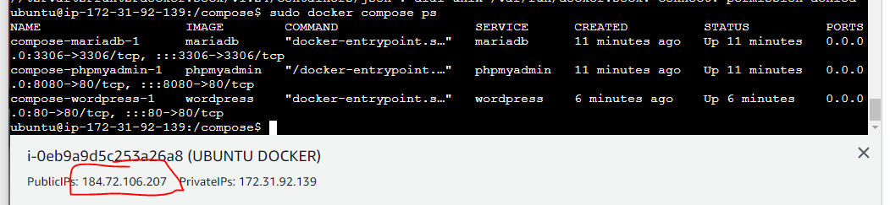
## Usando la ip pública de la máquina AWS, nos metemos en el navegador para configurar **WordPress**.
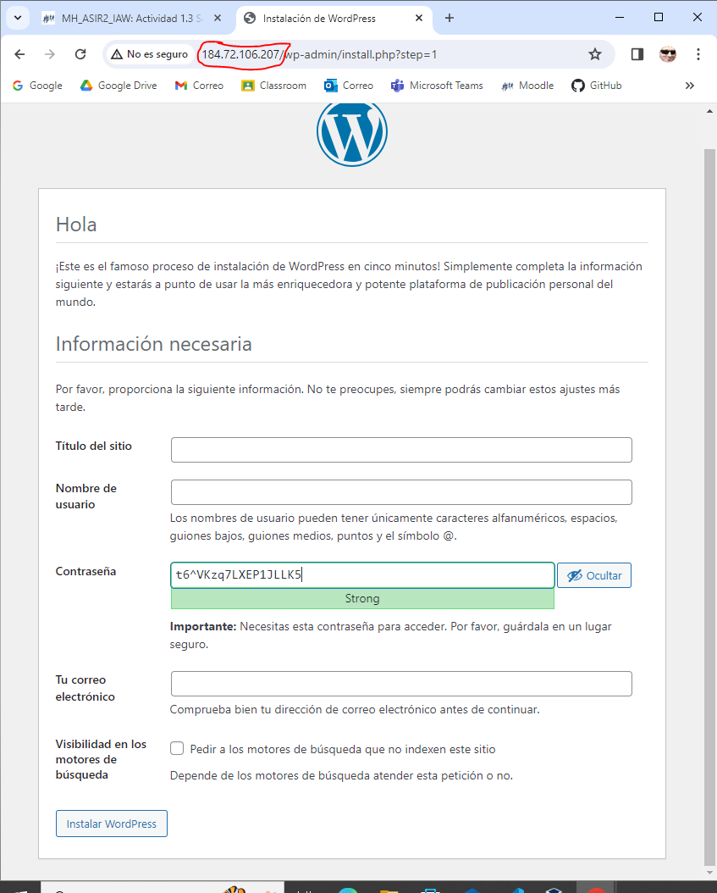
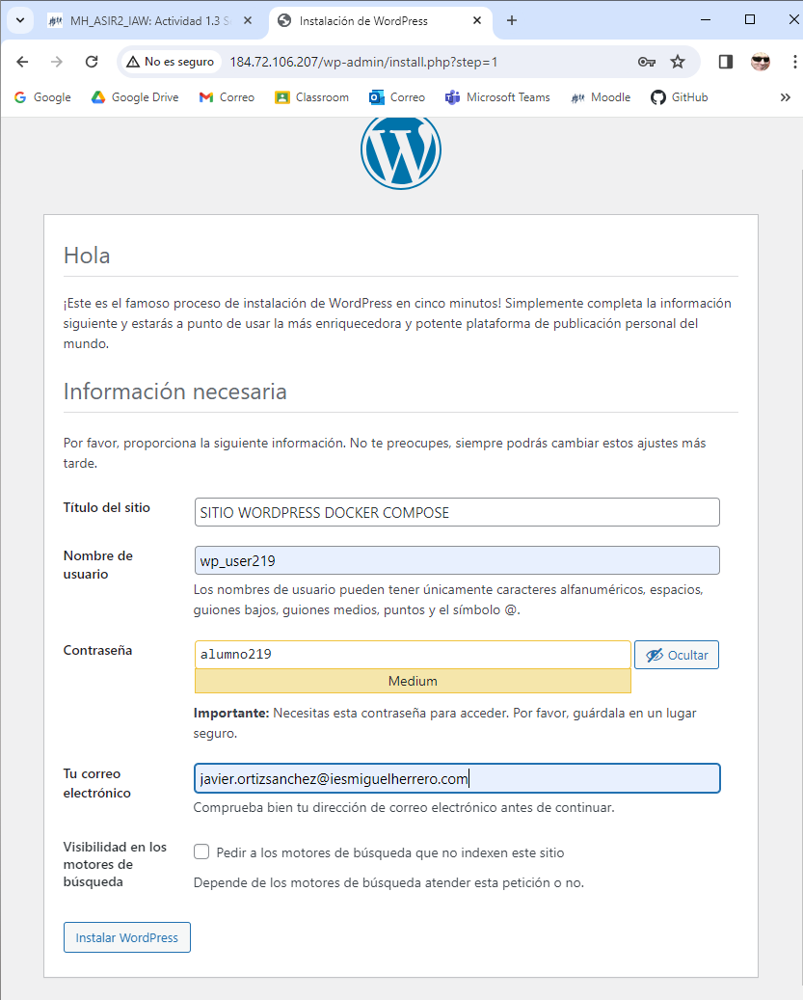
## Comprobamos que la conexión funciona y WordPress esta conectado a lo creado en los anteriores ejercicios.
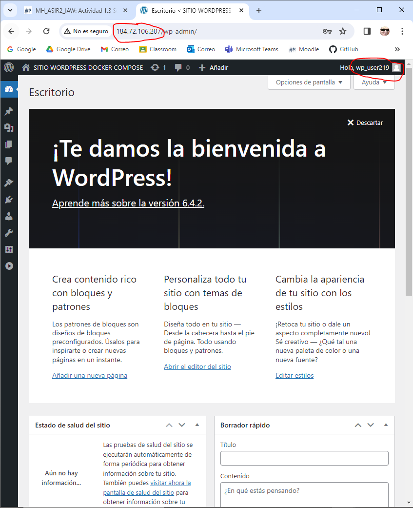
